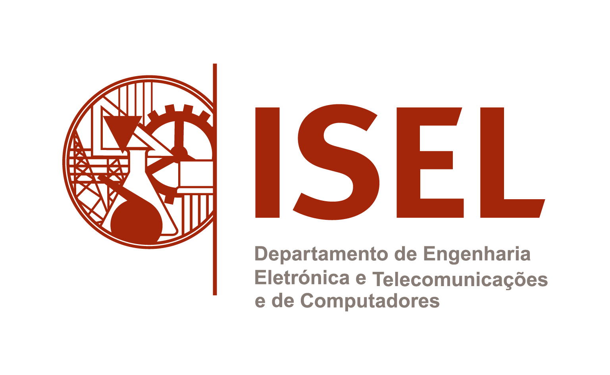

<h1  align="center">Roleta - LIC - 2024/2025</h1>

Trabalho realizado por Ricardo Martins (@RicardoAMMartins), Bernardo Silva (@bernzrdo) e Bernardo Esteves (@Olhalvo) para a unidade curricular LIC (Laboratório de Informática e Computadores) com uma classificação de 15 valores.